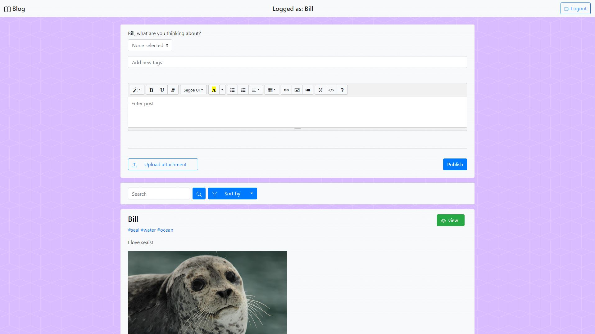
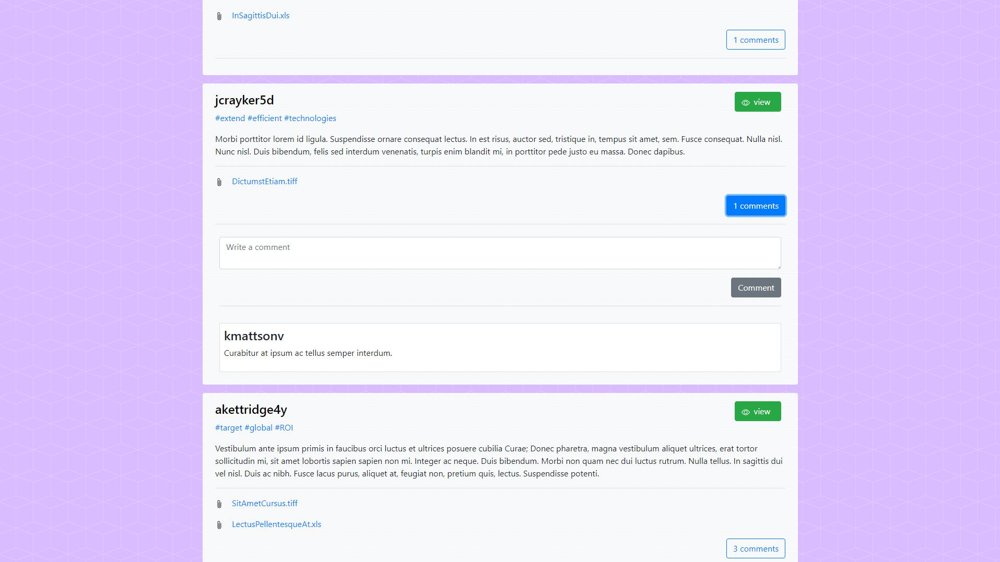
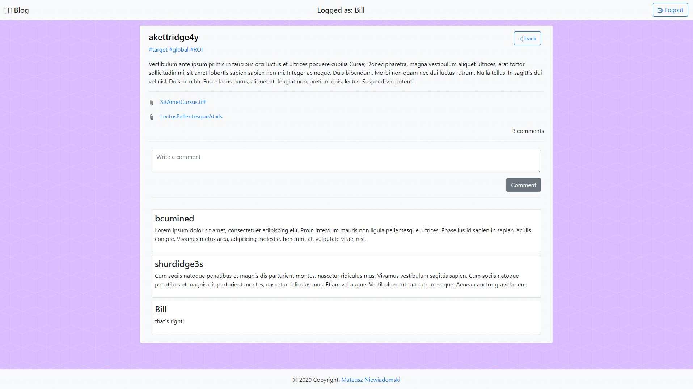
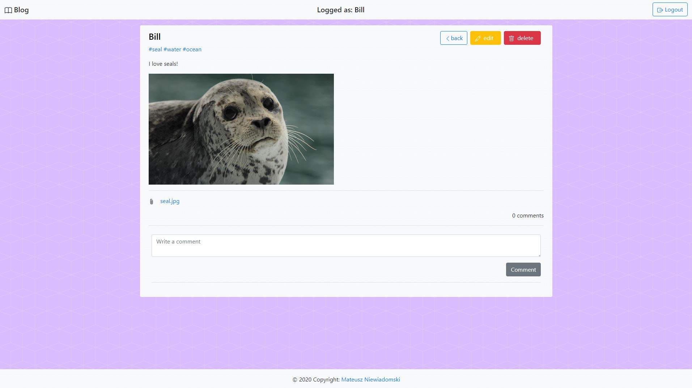
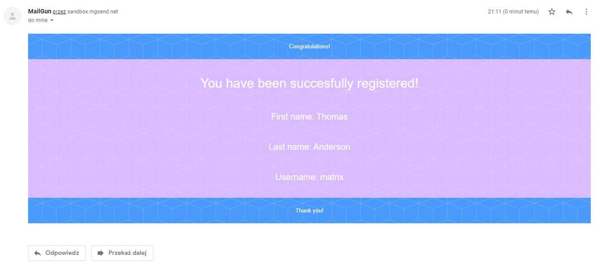

# Blog
### Spring application - blog
## Technologies
- Java 11
- Spring Boot 
- Spring Security
- Spring Data
- Thymeleaf
- PostgreSQL
- JPA / Hibernate
- Lombook
- Summernote
- Bootstrap
## Project includes
- add / edit / delete / comment posts
- login / register
- users with roles
- unregistered users can't access some content
- sorting / filtering posts
- database generated by beans from xml file, that was made procedurally from .csv files
- export database into .csv file
- attachment up to 128 MB can be stored on server
- REST API
## Screenshots
### Main window

### Posts

### Post author / admin view

### Generated email
